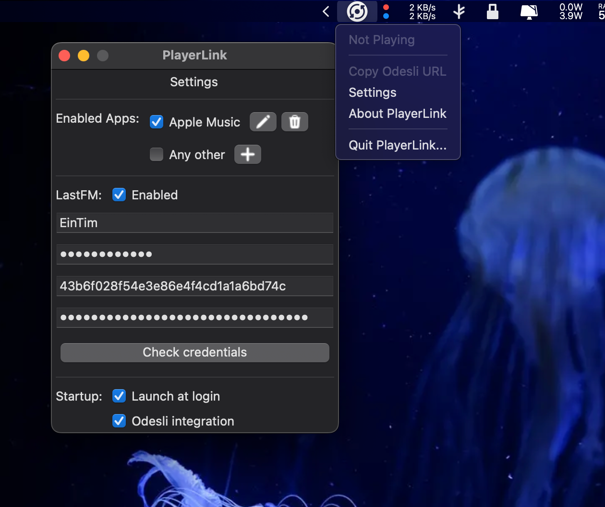
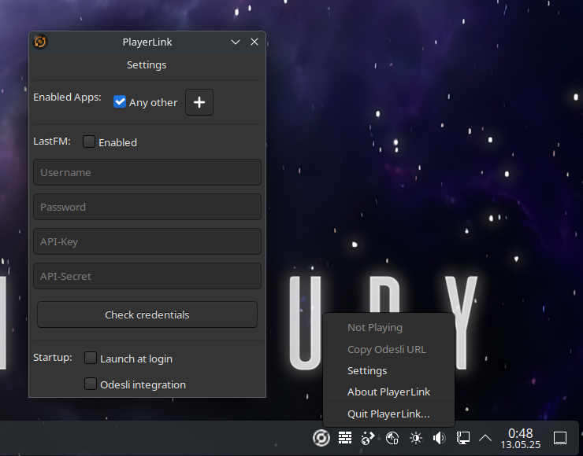
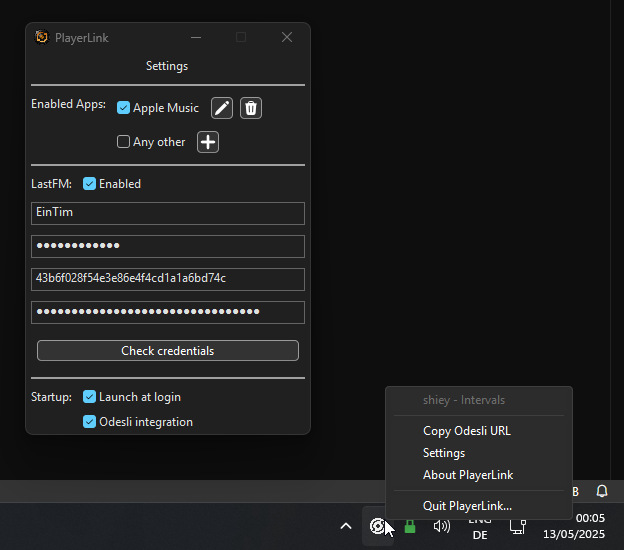

# PlayerLink
Cross platform, universal discord rich presence for media players.

## System requirements
- Mac OS 10.15 or later
- Windows 10 1809 or later
- Pretty much any linux distribution with gtk3 and dbus support

## Showcase
You can add predefined players to the settings.json to customise the name it shows in discord, edit the search button base url, and app icon. By default it will just display as "Music" without a search button or app icon. 

<p align="center" width="100%">
     
</p>
<p align="center" width="100%">
     
</p>
<p align="center" width="100%">
     
</p>
<p align="center" width="100%">
     
</p>

## Backends
### Windows
The Windows backend is powered by [Windows.Media.Control.GlobalSystemMediaTransportControlsSessionManager](https://learn.microsoft.com/en-us/uwp/api/windows.media.control.globalsystemmediatransportcontrolssessionmanager?view=winrt-26100) (horrible name I know) introduced in Windows 10 1809. It allows to query the system wide media information.

### Mac OS
The Mac OS backend is powered by the private MediaRemote framework. It provides PlayerLink with the currently playing song information.

### Linux
The linux backend is powered by [MPRIS](https://specifications.freedesktop.org/mpris-spec/latest/). It allows to query the system wide media information via dbus.

## Config
**Mac OS**
`~/Library/Application Support/PlayerLink`
**Linux**
`~/.config/PlayerLink`
**Windows**
`%appdata%\PlayerLink`

An example on how to add custom apps to the config can be found [here](./settings.example.json). In the future there will be a UI to configure custom apps in a more user friendly way.

## Building

### Prerequisites

#### Windows
- Visual Studio toolchain with CMake that supports C++ 17 and winrt. Clang or MSVC doesn't matter. You might be able to get mingw to work, but I personally had issues using winrt with mingw and therefore its unsupported.
- Git

#### Linux
- GTK3 developer libraries and includes
- A C++ 17 capable compiler (gcc or clang should both work)
- A C compiler
- CMake
- Git

#### Mac OS
- Xcode 11 or newer with the Mac OS toolchain installed
- CMake
- Git

### How to build
1. Open your unix shell or Windows Developer Powershell

2. Clone the repository recursively to include submodules and enter the directory
    ```bash
    git clone --recursive https://github.com/EinTim23/PlayerLink.git
    cd PlayerLink
    ```
3. Use CMake to configure the project
    ```bash
    # for a release build
    cmake -S . -B build -DCMAKE_BUILD_TYPE=Release
    # for a debug build
    cmake -S . -B build
    ```
4. Build the project :)
    ```bash
    # for a release build
    cmake --build build --config Release
    # for a debug build
    cmake --build build
    ```

## Contributing
This repository is open for contributions. You can view the current roadmap [here](https://github.com/EinTim23/PlayerLink/projects) or implement your own features and then open a pull request. Please keep your code as consistent and clean as possible.

## Credits
This project was heavily inspired by [Alexandra Aurora's MusicRPC](https://github.com/AlexandraAurora/MusicRPC) and her project may provide a better experience when being on Mac OS only.